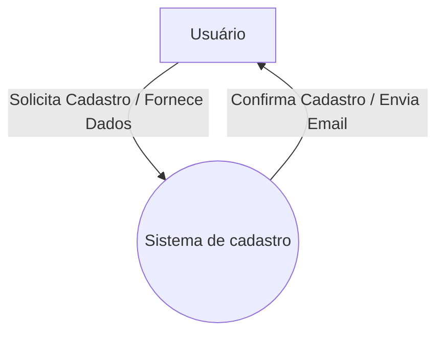
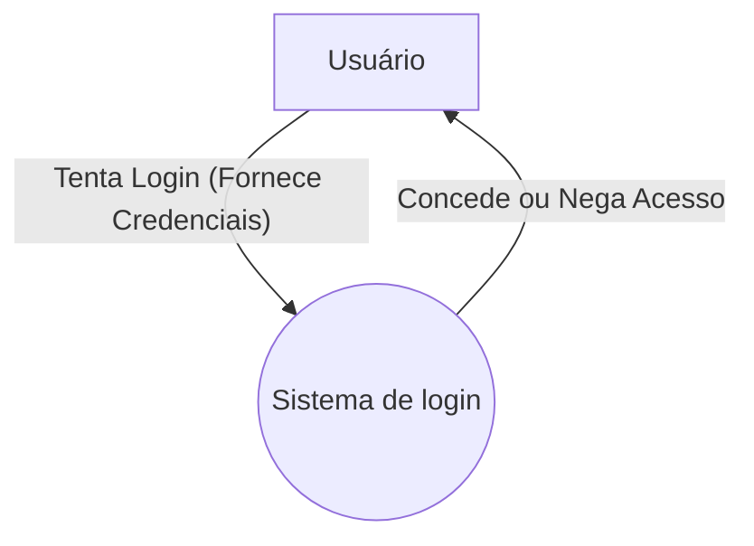
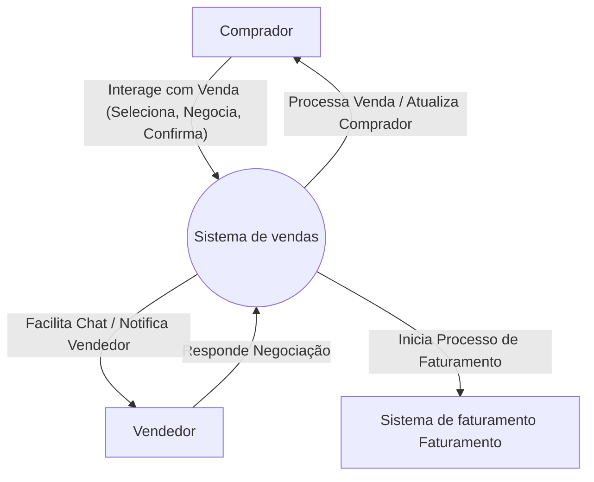
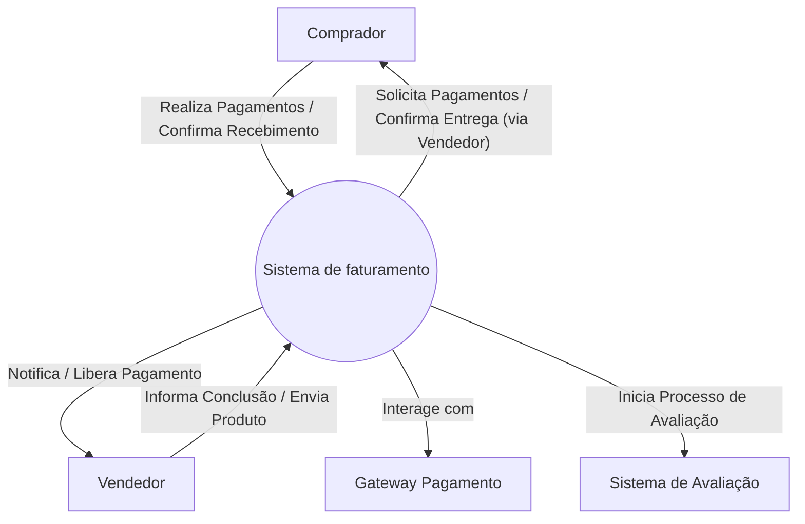
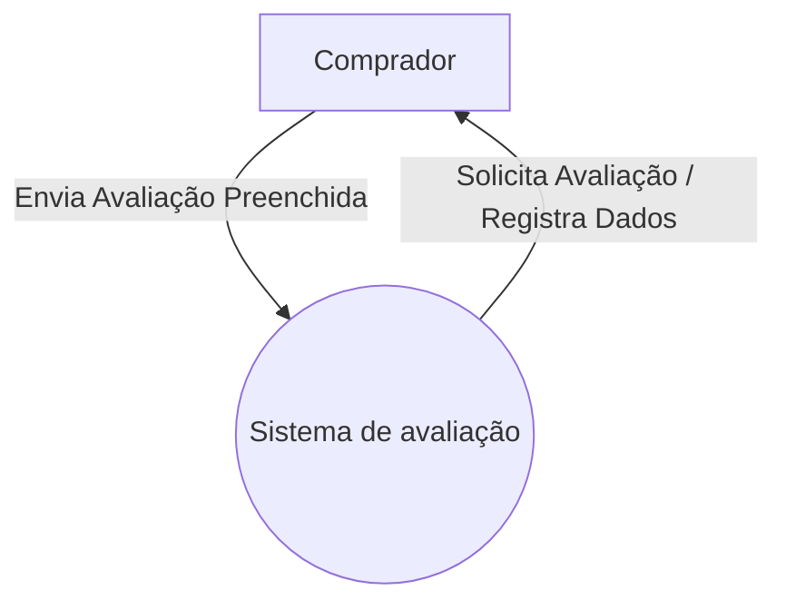
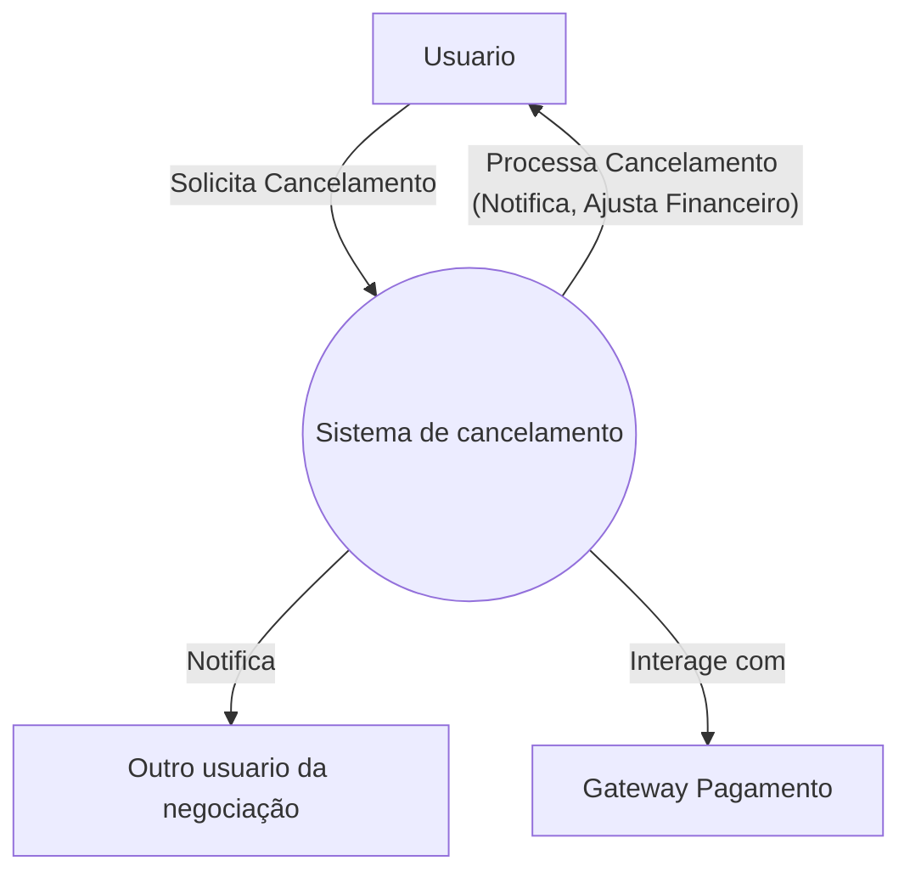
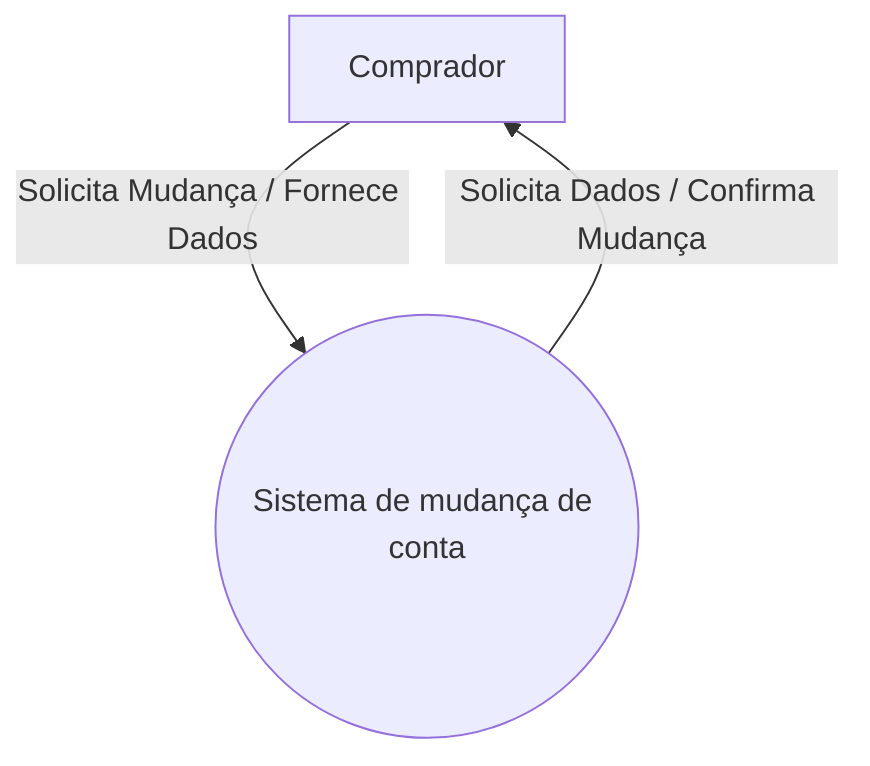
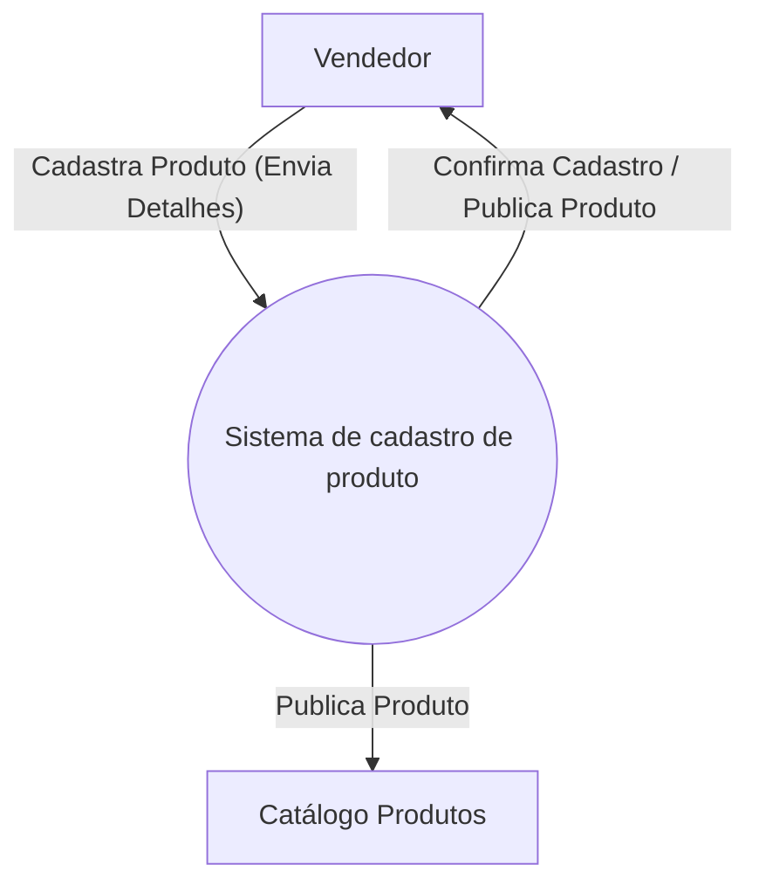

# Diagramas de Contexto - TechSales

## 1. Processo de Cadastro

## 2. Processo de Login

## 3. Processo de Venda

## 4. Processo de Faturamento

## 5. Processo de Avaliação

## 6. Processo de Cancelamento

## 7. Processo de Mudança de Tipo de Conta (Comprador para Vendedor)

## 8. Processo de Cadastro de Produto

