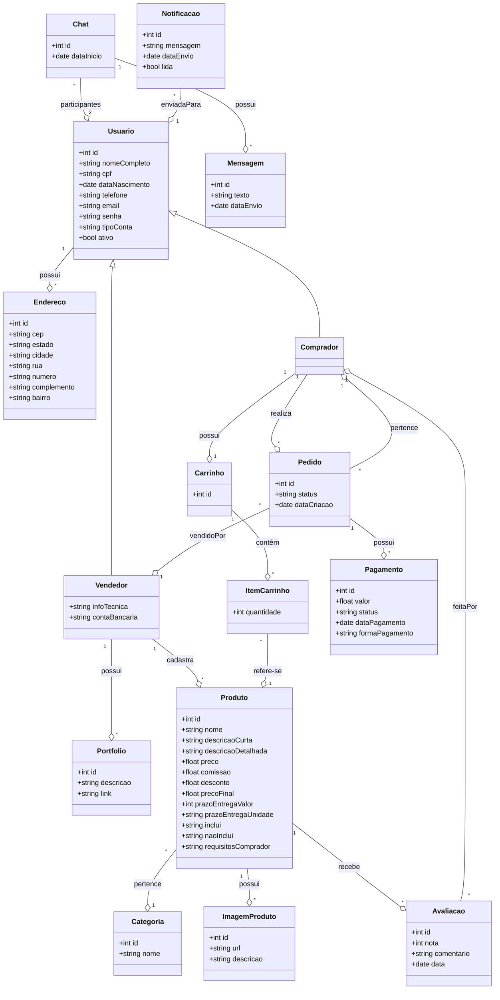

```mermaid
classDiagram
    class Usuario {
        +int id
        +string nomeCompleto
        +string cpf
        +date dataNascimento
        +string telefone
        +string email
        +string senha
        +string tipoConta
        +bool ativo
    }
    class Endereco {
        +int id
        +string cep
        +string estado
        +string cidade
        +string rua
        +string numero
        +string complemento
        +string bairro
    }
    class Comprador {
    }
    class Vendedor {
        +string infoTecnica
        +string contaBancaria
    }
    class Portfolio {
        +int id
        +string descricao
        +string link
    }
    class Produto {
        +int id
        +string nome
        +string descricaoCurta
        +string descricaoDetalhada
        +float preco
        +float comissao
        +float desconto
        +float precoFinal
        +int prazoEntregaValor
        +string prazoEntregaUnidade
        +string inclui
        +string naoInclui
        +string requisitosComprador
    }
    class Categoria {
        +int id
        +string nome
    }
    class ImagemProduto {
        +int id
        +string url
        +string descricao
    }
    class Carrinho {
        +int id
    }
    class ItemCarrinho {
        +int quantidade
    }
    class Pedido {
        +int id
        +string status
        +date dataCriacao
    }
    class Pagamento {
        +int id
        +float valor
        +string status
        +date dataPagamento
        +string formaPagamento
    }
    class Avaliacao {
        +int id
        +int nota
        +string comentario
        +date data
    }
    class Chat {
        +int id
        +date dataInicio
    }
    class Mensagem {
        +int id
        +string texto
        +date dataEnvio
    }
    class Notificacao {
        +int id
        +string mensagem
        +date dataEnvio
        +bool lida
    }

    Usuario "1" --o "*" Endereco : possui
    Usuario <|-- Comprador
    Usuario <|-- Vendedor
    Vendedor "1" --o "*" Portfolio : possui
    Vendedor "1" --o "*" Produto : cadastra
    Produto "*" --o "1" Categoria : pertence
    Produto "1" --o "*" ImagemProduto : possui
    Comprador "1" --o "1" Carrinho : possui
    Carrinho "1" --o "*" ItemCarrinho : contém
    ItemCarrinho "*" --o "1" Produto : refere-se
    Comprador "1" --o "*" Pedido : realiza
    Pedido "1" --o "*" Pagamento : possui
    Pedido "*" --o "1" Comprador : pertence
    Pedido "*" --o "1" Vendedor : vendidoPor
    Produto "1" --o "*" Avaliacao : recebe
    Avaliacao "*" --o "1" Comprador : feitaPor
    Chat "*" --o "2" Usuario : participantes
    Chat "1" --o "*" Mensagem : possui
    Notificacao "*" --o "1" Usuario : enviadaPara
```