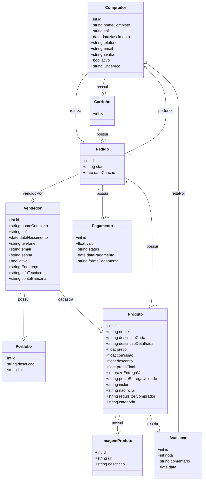

```mermaid
classDiagram
    class Comprador {
        +int id
        +string nomeCompleto
        +string cpf
        +date dataNascimento
        +string telefone
        +string email
        +string senha
        +bool ativo
        +string Endereço
    }
    class Vendedor {
        +int id
        +string nomeCompleto
        +string cpf
        +date dataNascimento
        +string telefone
        +string email
        +string senha
        +bool ativo
        +string Endereço
        +string infoTecnica
        +string contaBancaria
    }
    class Portfolio {
        +int id
        +string descricao
        +string link
    }
    class Produto {
        +int id
        +string nome
        +string descricaoCurta
        +string descricaoDetalhada
        +float preco
        +float comissao
        +float desconto
        +float precoFinal
        +int prazoEntregaValor
        +string prazoEntregaUnidade
        +string inclui
        +string naoInclui
        +string requisitosComprador
        +string categoria
    }
    class ImagemProduto {
        +int id
        +string url
        +string descricao
    }
    class Carrinho {
        +int id
    }
    class Pedido {
        +int id
        +string status
        +date dataCriacao
    }
    class Pagamento {
        +int id
        +float valor
        +string status
        +date dataPagamento
        +string formaPagamento
    }
    class Avaliacao {
        +int id
        +int nota
        +string comentario
        +date data
    }

    Vendedor "1" --o "*" Portfolio : possui
    Vendedor "1" --o "*" Produto : cadastra
    Produto "1" --o "*" ImagemProduto : possui
    Comprador "1" --o "1" Carrinho : possui
    Comprador "1" --o "*" Pedido : realiza
    Carrinho "1" --o "*" Pedido : possui
    Pedido "1" --o "1..2" Pagamento : possui
    Pedido "*" --o "1" Comprador : pertence
    Pedido "*" --o "1" Vendedor : vendidoPor
    Pedido "1" --o "1..*" Produto : possui
    Produto "1" --o "*" Avaliacao : recebe
    Avaliacao "*" --o "1" Comprador : feitaPor
    
```
