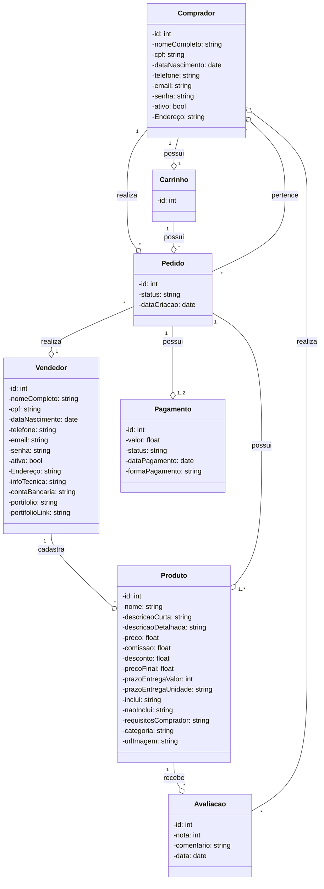

```mermaid
classDiagram
    class Comprador {
        -id: int
        -nomeCompleto: string
        -cpf: string
        -dataNascimento: date
        -telefone: string
        -email: string
        -senha: string
        -ativo: bool
        -Endereço: string
    }
    class Vendedor {
        -id: int
        -nomeCompleto: string
        -cpf: string
        -dataNascimento: date
        -telefone: string
        -email: string
        -senha: string
        -ativo: bool
        -Endereço: string
        -infoTecnica: string
        -contaBancaria: string
        -portifolio: string
        -portifolioLink: string
    }
    class Produto {
        -id: int
        -nome: string
        -descricaoCurta: string
        -descricaoDetalhada: string
        -preco: float
        -comissao: float
        -desconto: float
        -precoFinal: float
        -prazoEntregaValor: int
        -prazoEntregaUnidade: string
        -inclui: string
        -naoInclui: string
        -requisitosComprador: string
        -categoria: string
        -urlImagem: string
    }

    class Carrinho {
        -id: int
    }
    class Pedido {
        -id: int
        -status: string
        -dataCriacao: date
    }
    class Pagamento {
        -id: int
        -valor: float
        -status: string
        -dataPagamento: date
        -formaPagamento: string
    }
    class Avaliacao {
        -id: int
        -nota: int
        -comentario: string
        -data: date
    }

    Vendedor "1" --o "*" Produto : cadastra
    Comprador "1" --o "1" Carrinho : possui
    Comprador "1" --o "*" Pedido : realiza
    Carrinho "1" --o "*" Pedido : possui
    Pedido "1" --o "1..2" Pagamento : possui
    Pedido "*" --o "1" Comprador : pertence
    Pedido "*" --o "1" Vendedor : realiza
    Pedido "1" --o "1..*" Produto : possui
    Produto "1" --o "*" Avaliacao : recebe
    Avaliacao "*" --o "1" Comprador : realiza
    
```
