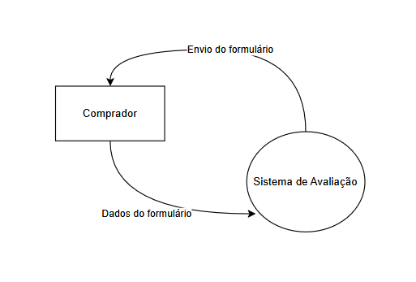
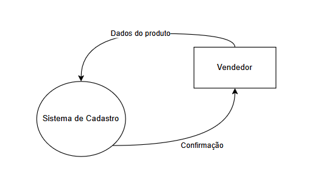
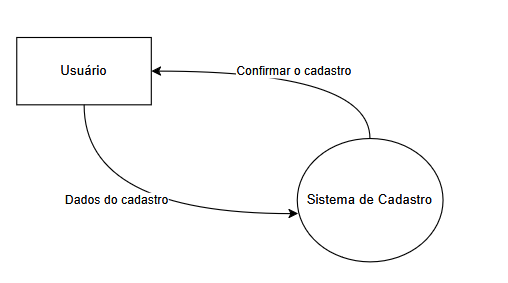
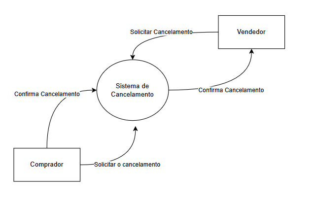
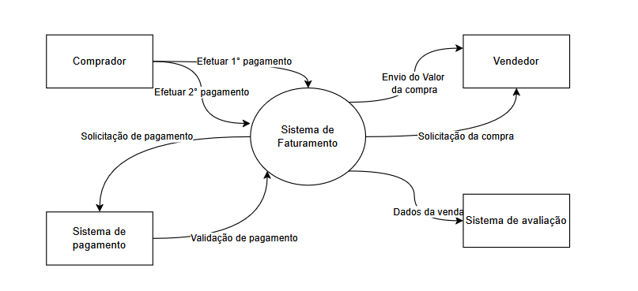
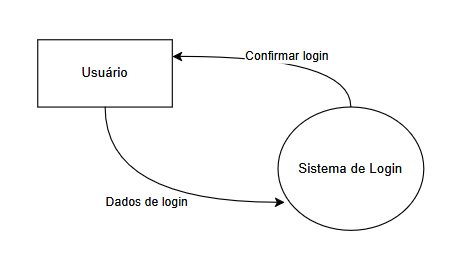
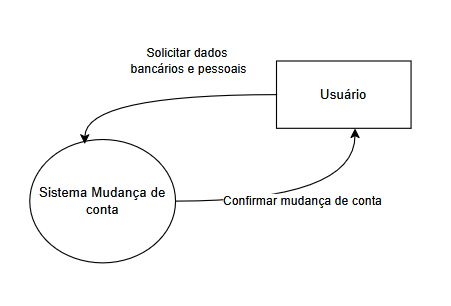
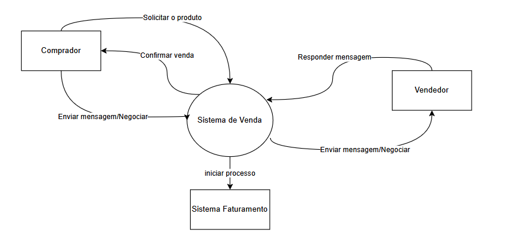

# Diagrama de Contexto:

## Avaliação:

## Cadastro de Produtos:

## Cadastro:

## Cancelamento:

## Faturamento:

## Login:

## Mudança de Conta:

## Venda:

# Casos de Uso

.png)

## Caso de uso 1 | UC-01 :   Gerenciar Carrinho

|Identificador|UC-01|
|-------------|-----|
|Função|Permitir que o cliente consiga fazer o gerenciamento (Inserir, atualizar ou remover ) do carrinho dos produtos.|
|Atores|Cliente e Sistema.|
|Pré Condição|1. Estar logado.   2. Produto cadastrado na plataforma.|
|Pós Condição|Carrinho atualizado para o cliente|
|Fluxo Principal|1. Cliente Loga  2. Cliente acessa a pagina do produto   3. Cliente clicka no botão de adicionar no carrinho   4. Sistema adiciona no carrinho o produto|
|Fluxo Alternativo|1. Cliente Acessa a tela do carrinho   2. Cliente e realiza remoção ou atualização do produto   3. Sistema realiza a tarefa de exclusão ou atualização|

## Caso de uso 2 | UC-02 :   Comprar produto
|Identificador|UC02|
|-------------|-----|
|Função|Permitir que o comprador adquira produtos ou serviços na plataforma.|
|Atores|Comprador, Sistema, Vendedor e Gateway de Pagamento.|
|Pré Condição|1. Comprador deve estar logado.   2. O produto deve estar cadastrado na plataforma |
|Pós Condição|1. Produto adicionado ao histórico de compras do comprador 2. Produto adicionado ao historico de venda do vendedor   3. Produto entregue.|
|Fluxo Principal|1. Comprador Loga.  2. Comprador acessa a pagina do produto.   3. Comprador clica no botão de "Comprar Agora"   4. Sistema inicia o processo de pagamento   5. Comprador insere as informações de pagamento   6. Sistema verifica a integridade dos dados   7. Gateway de pagamento realiza a transação  7.5 Sistema guarda o valor até a finalização da entrega 8. Comprador realiza a primeira etapa de pagamento   9. Comprador Inicia chat com o vendedor   10. Comprador paga a segunda etapa apos entrega do produto   11. Gateway de pagamento realiza a transação|
|Fluxo Alternativo|A1. Comprador acessa o carrinho   A2. Comprador clica em "Prossegir para o Pagamento"  A3.Segue fluxo pincipal a partir do item 4 
B1. Comprador inicial chat com o vendedor  B2. Inicial o fluxo principal a partir do item 3|
|Fluxo de Excessão| E1. Comprador Cancela a compra  - E1.1. Inicia processo de cancelamento
E2. Vendedor cancela a venda  -  E2.1. Iniciar processo de cancelamento
 E3. Vendedor não entrega produto a tempo  - E3.1 Inicia processo de cancelamento|

## Caso de uso 3 | UC-03 :  Avaliar Produto
|Identificador|UC-03|
|-------------|-----|
|Função|Avaliar produto comprado.|
|Atores|Comprador e Sistema.|
|Pré Condição|1. Comprador logado.  2. Compra realizada do determinado produto.|
|Pós Condição|Produto é rankeado a partir das avaliações.|
|Fluxo Principal|1. Sistema envia um e-mail  2. Comprador acessa o link recebido   3. Comprador preenche os campos do formulario   4. Comprador Clickar em "Enviar Avaliação"   5. Sistema computa a avaliação |

## Caso de uso 4 | UC-04 :  Abrir Chat

|Identificador|UC-04|
|-------------|-----|
|Função|Conversa entre ambas as partes da negociação.|
|Atores|Cliente, Vendedor e Sistema.|
|Pré Condição| 1. Comprador Logado|
|Fluxo Principal|1. Comprador acessa a pagina do produto  2. Comprador clica no botão "Iniciar Chat com o Vendedor"   3. Sistema cria uma instancia de chat com ambas as partes   4. Vendedor e Cliente se comunicam|

## Caso de uso 5 | UC-05 :  Gerenciar perfil

|Identificador|UC-05|
|-------------|-----|
|Função|Atualizar informações do perfil|
|Atores|Cliente, Vendedor e sistema|
|Pré Condição|Estar logado|
|Pós Condição|Informações atualizadas|
|Fluxo Principal|1. Usuario acessa a pagina de configuração de conta   2. Usuario realiza as mudanças  3. Usuario submete as modificações   4. Sistema realiza a operação desejada|

## Caso de uso 6 | UC-06 : Cancelar Transação

|Identificador|UC-06|
|-------------|-----|
|Função|Cancelar a operação de venda ou compra|
|Atores|Cliente, Vendedor e sistema|
|Pré Condição|1. Usuario logado   2. Primeira etapa da compra de um produto ja realizada|
|Pós Condição|Venda cancelada, historicos de compra do cliente atualizado e historico de vendas do vendedor atualizado |
|Fluxo Principal|1. Comprador Acessa o historico de compras   2. Comprador clica em "Cancelar" no produto em andamento  3. Sistema mostra uma mensagem de confirmação 4. sistema inicia  pagamento ao vendedor do valor da primeira etapa de compra  5. Sistema notifica vendedor sobre o cancelamento|
|Fluxo Alternativo|A1. Vendedor acessa a pagina de vendas  A2. Vendedor clica no botão de "Cancelar" no produto em andamento ou em produção  3. Sistema mostra uma mensagem de confirmação  4. Sistema reembolsa o valor da primeira etapa de compra ao comprador 
Se o entregador não entregue antes  B1. Sistema verifica data de entrega   B2. Enviar Aviso ao vendedor  B3. Valor é reembolsado para o comprador |

## Caso de uso 7 | UC-07 : Entregar Produto

|Identificador|UC-07|
|-------------|-----|
|Função|Entragar o produto desenvolvido pelo vendedor.|
|Atores|Vendedo, Comprador e sistema.|
|Pré Condição|Compra do produto realizada.|
|Pós Condição|1. Venda concluida  2. status na tela de historico de vendas do vendedor como concluido 3. Segunda etapa do processo de venda realizada|
|Fluxo Principal|1. Vendedor acessa a pagina de vendas   2. Vendedor clica no botão "Marcar Entregue"  3. Sistema mostra uma modal com os campos para realizar a entregua  4. Vendedor faz o upload da entrega   5. Sistema computa entrega  6. Sistema continua fluxo no processo de compra|

## Caso de uso 8 | UC-08 : Virar Vendedor

|Identificador|UC-08|
|-------------|-----|
|Função|Mudar o tipo de conta de comprador para vendedor.|
|Atores|Comprador e sistema.|
|Pré Condição|1. Usuário logado   2. Usuário ser do tipo comprador|
|Pós Condição|Conta de comprador vira vendedor|
|Fluxo Principal|1. Comprador acessa a tela de perfil  2. Comprador clica no botão "Tornar-se Vendedor"   3. Sistema mostra uma modal com um formulario para preencher as informações de vendedor   4. Comprador preenche informações solicitadas   5. Comprador submete a Solicitação   6. Sistema realiza a mudança do tipo de conta|

## Caso de uso 9 | UC-09 : Gerenciar Produto

|Identificador|UC-09|
|-------------|-----|
|Função|Gerenciar os produtos (Criar, Deletar ou Atualizar)|
|Atores|Vendedor e sistema|
|Pré Condição|Comprador logado|
|Pós Condição|Atualização feita nos produtos do vendedor|
|Fluxo Principal|1. Vendedor acessa a tela de cadastro de produto  2. Sistema disponibiliza um formulario para cadastrar as informações   3. Vendedor preenche o formulario   4. Vendedor submete a criação do produto   5. Sistema realiza a operação de criar produto   |
|Fluxo Alternativo|A1. Vendedor acessa a tela de produtos cadastrados   A2. Vendedor seleciona produto para realizar alteração   A3. Sistema disponibiliza formulario para mudança   A4. Vendedor preenche as informações a serem atualizadas   A5. Vendedor submete atualização   A6. Sistema realiza a operação de atualizar produto 
 B1. Vendedor acessa a tela de produtos   B2. Vendedor clicka em Excluir   B3. Sistema mostra uma tela de confirmação   B4. Vendedor confirma   Sistema realiza a remoção do produto|
