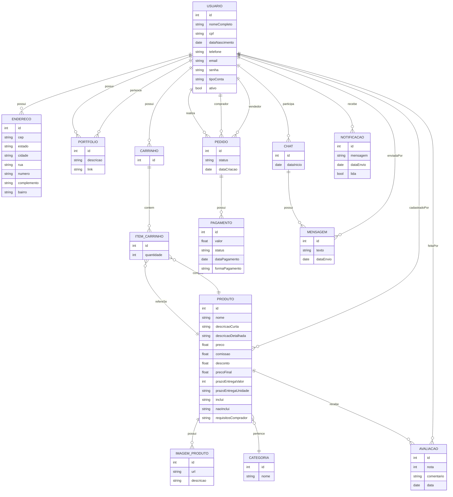

```mermaid
erDiagram
    USUARIO {
        int id
        string nomeCompleto
        string cpf
        date dataNascimento
        string telefone
        string email
        string senha
        string tipoConta
        bool ativo
    }
    ENDERECO {
        int id
        string cep
        string estado
        string cidade
        string rua
        string numero
        string complemento
        string bairro
    }
    PORTFOLIO {
        int id
        string descricao
        string link
    }
    PRODUTO {
        int id
        string nome
        string descricaoCurta
        string descricaoDetalhada
        float preco
        float comissao
        float desconto
        float precoFinal
        int prazoEntregaValor
        string prazoEntregaUnidade
        string inclui
        string naoInclui
        string requisitosComprador
    }
    CATEGORIA {
        int id
        string nome
    }
    IMAGEM_PRODUTO {
        int id
        string url
        string descricao
    }
    CARRINHO {
        int id
    }
    ITEM_CARRINHO {
        int id
        int quantidade
    }
    PEDIDO {
        int id
        string status
        date dataCriacao
    }
    PAGAMENTO {
        int id
        float valor
        string status
        date dataPagamento
        string formaPagamento
    }
    AVALIACAO {
        int id
        int nota
        string comentario
        date data
    }
    CHAT {
        int id
        date dataInicio
    }
    MENSAGEM {
        int id
        string texto
        date dataEnvio
    }
    NOTIFICACAO {
        int id
        string mensagem
        date dataEnvio
        bool lida
    }

    USUARIO ||--o{ ENDERECO : possui
    USUARIO ||--o{ PORTFOLIO : possui
    USUARIO ||--o{ CARRINHO : possui
    USUARIO ||--o{ PEDIDO : realiza
    USUARIO ||--o{ CHAT : participa
    USUARIO ||--o{ NOTIFICACAO : recebe
    PORTFOLIO }o--|| USUARIO : pertence
    PRODUTO ||--o{ IMAGEM_PRODUTO : possui
    PRODUTO }o--|| CATEGORIA : pertence
    PRODUTO ||--o{ ITEM_CARRINHO : compoe
    PRODUTO ||--o{ AVALIACAO : recebe
    PRODUTO }o--|| USUARIO : cadastradoPor
    CARRINHO ||--o{ ITEM_CARRINHO : contem
    ITEM_CARRINHO }o--|| PRODUTO : refereSe
    PEDIDO ||--o{ PAGAMENTO : possui
    PEDIDO }o--|| USUARIO : comprador
    PEDIDO }o--|| USUARIO : vendedor
    AVALIACAO }o--|| USUARIO : feitaPor
    CHAT ||--o{ MENSAGEM : possui
    MENSAGEM }o--|| USUARIO : enviadaPor
```