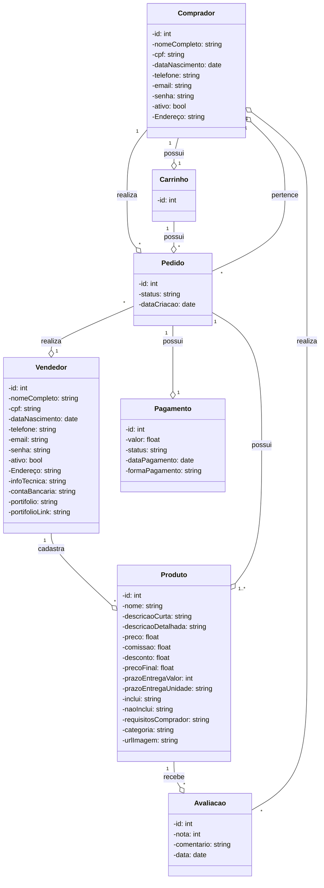

# Descrição das Classes

## Comprador
Representa o usuário que realiza compras na plataforma. Todo usuário inicialmente é registrado como comprador, podendo posteriormente se tornar vendedor. O comprador possui um carrinho de compras, pode realizar pedidos e fazer avaliações dos produtos adquiridos.

## Vendedor
Representa o usuário que cadastra e vende produtos na plataforma. O vendedor possui informações técnicas específicas, conta bancária para recebimentos e portfólio para demonstrar suas habilidades. Pode cadastrar múltiplos produtos e receber avaliações sobre seus produtos.

## Produto
Representa os itens ou serviços disponíveis para venda na plataforma. Cada produto possui informações detalhadas como preço, comissão para a plataforma, prazo de entrega, requisitos e descrições. Produtos com maior comissão recebem maior destaque na plataforma.

## Carrinho
Representa o carrinho de compras do comprador, onde são armazenados temporariamente os produtos que o comprador deseja adquirir. Cada comprador possui um único carrinho, que pode conter múltiplos produtos.

## Pedido
Representa uma transação de compra realizada pelo comprador. O pedido possui um status que indica seu estágio (em andamento, finalizado, cancelado) e está associado a um ou dois pagamentos (primeira e segunda parcela). Cada pedido pertence a um comprador e um vendedor.

## Pagamento
Representa as transações financeiras realizadas na plataforma. Cada pedido pode ter um ou dois pagamentos (primeira e segunda parcela). O pagamento possui informações sobre valor, status, data e forma de pagamento.

## Avaliação
Representa as avaliações feitas pelos compradores sobre os produtos adquiridos. As avaliações incluem nota e comentário, e são utilizadas para ranquear produtos e vendedores na plataforma. Um comprador não pode avaliar seus próprios produtos.
