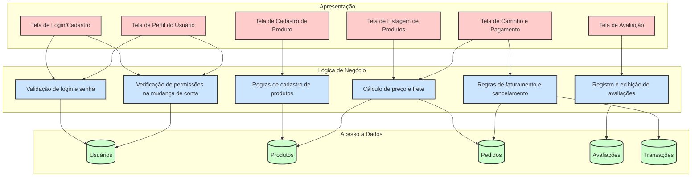

```mermaid
flowchart TD
    %% Camada de Apresentação
    subgraph Apresentação
        A1[Tela de Login/Cadastro]
        A2[Tela de Cadastro de Produto]
        A3[Tela de Listagem de Produtos]
        A4[Tela de Carrinho e Pagamento]
        A5[Tela de Avaliação]
        A6[Tela de Perfil do Usuário]
    end

    %% Camada de Lógica de Negócio
    subgraph "Lógica de Negócio"
        B1[Validação de login e senha]
        B2[Regras de cadastro de produtos]
        B3[Cálculo de preço e frete]
        B4[Regras de faturamento e cancelamento]
        B5[Verificação de permissões na mudança de conta]
        B6[Registro e exibição de avaliações]
    end

    %% Camada de Acesso a Dados
    subgraph "Acesso a Dados"
        C1[(Usuários)]
        C2[(Produtos)]
        C3[(Pedidos)]
        C4[(Avaliações)]
        C5[(Transações)]
    end

    %% Conexões entre Apresentação e Lógica de Negócio
    A1 --> B1
    A1 --> B5
    A2 --> B2
    A3 --> B3
    A4 --> B3
    A4 --> B4
    A5 --> B6
    A6 --> B1
    A6 --> B5

    %% Conexões entre Lógica de Negócio e Acesso a Dados
    B1 --> C1
    B2 --> C2
    B3 --> C2
    B3 --> C3
    B4 --> C3
    B4 --> C5
    B5 --> C1
    B6 --> C4

    %% Estilo das camadas
    classDef apresentacao fill:#ffcccc,stroke:#333,stroke-width:2px;
    classDef negocio fill:#cce5ff,stroke:#333,stroke-width:2px;
    classDef dados fill:#ccffcc,stroke:#333,stroke-width:2px;

    class A1,A2,A3,A4,A5,A6 apresentacao;
    class B1,B2,B3,B4,B5,B6 negocio;
    class C1,C2,C3,C4,C5 dados;
```