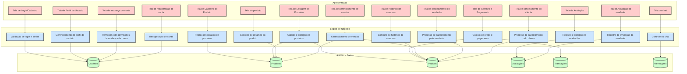

```mermaid
flowchart TD
    %% Camada de Apresentação
    subgraph Apresentação
        A1[Tela de Login/Cadastro]
        A2[Tela de Cadastro de Produto]
        A3[Tela de Listagem de Produtos]
        A4[Tela de Carrinho e Pagamento]
        A5[Tela de Avaliação]
        A6[Tela de Perfil do Usuário]
        A7[Tela de Histórico de compras]
        A8[Tela do produto]
        A9[Tela de mudança de conta]
        A10[Tela de gerenciamento de vendas]
        A11[Tela de recuperação de conta]
        A12[Tela do chat]
        A13[Tela de cancelamento do vendedor]
        A14[Tela de cancelamento do cliente]
        A15[Tela de Avaliação do vendedor]
    end

    %% Camada de Lógica de Negócio
    subgraph "Lógica de Negócio"
        B1[Validação de login e senha]
        B2[Regras de cadastro de produtos]
        B3[Cálculo e exibição de produtos]
        B4[Cálculo de preço e pagamento]
        B5[Registro e exibição de avaliações]
        B6[Gerenciamento de perfil do usuário]
        B7[Consulta ao histórico de compras]
        B8[Exibição de detalhes do produto]
        B9[Verificação de permissões de mudança de conta]
        B10[Gerenciamento de vendas]
        B11[Recuperação de conta]
        B12[Controle do chat]
        B13[Processo de cancelamento pelo vendedor]
        B14[Processo de cancelamento pelo cliente]
        B15[Registro de avaliação do vendedor]
    end

    %% Camada de Acesso a Dados
    subgraph "Acesso a Dados"
        C1[(Usuários)]
        C2[(Produtos)]
        C3[(Pedidos)]
        C4[(Avaliações)]
        C5[(Transações)]
        C6[(Mensagens)]
    end

    %% Conexões entre Apresentação e Lógica de Negócio
    A1 --> B1
    A2 --> B2
    A3 --> B3
    A4 --> B4
    A5 --> B5
    A6 --> B6
    A7 --> B7
    A8 --> B8
    A9 --> B9
    A10 --> B10
    A11 --> B11
    A12 --> B12
    A13 --> B13
    A14 --> B14
    A15 --> B15

    %% Conexões entre Lógica de Negócio e Acesso a Dados
    B1 --> C1
    B2 --> C2
    B3 --> C2
    B3 --> C3
    B4 --> C3
    B4 --> C5
    B5 --> C4
    B6 --> C1
    B7 --> C3
    B8 --> C2
    B9 --> C1
    B10 --> C2
    B10 --> C3
    B11 --> C1
    B12 --> C6
    B13 --> C3
    B14 --> C3
    B15 --> C4

    %% Estilo das camadas
    classDef apresentacao fill:#ffcccc,stroke:#333,stroke-width:2px;
    classDef negocio fill:#cce5ff,stroke:#333,stroke-width:2px;
    classDef dados fill:#ccffcc,stroke:#333,stroke-width:2px;

    class A1,A2,A3,A4,A5,A6,A7,A8,A9,A10,A11,A12,A13,A14,A15 apresentacao;
    class B1,B2,B3,B4,B5,B6,B7,B8,B9,B10,B11,B12,B13,B14,B15 negocio;
    class C1,C2,C3,C4,C5,C6 dados;
```