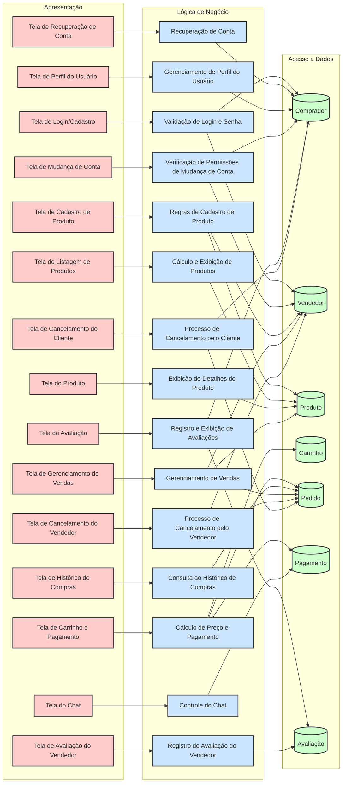

```mermaid
flowchart LR
    %% Camada de Apresentação
    subgraph Apresentação
        A1[Tela de Login/Cadastro]
        A2[Tela de Recuperação de Conta]
        A6[Tela de Perfil do Usuário]
        A9[Tela de Mudança de Conta]
        A3[Tela de Listagem de Produtos]
        A8[Tela do Produto]
        A2A[Tela de Cadastro de Produto]
        A4[Tela de Carrinho e Pagamento]
        A5[Tela de Avaliação]
        A7[Tela de Histórico de Compras]
        A10[Tela de Gerenciamento de Vendas]
        A12[Tela do Chat]
        A13[Tela de Cancelamento do Vendedor]
        A14[Tela de Cancelamento do Cliente]
        A15[Tela de Avaliação do Vendedor]
    end

    %% Camada de Lógica de Negócio
    subgraph "Lógica de Negócio"
        B1[Validação de Login e Senha]
        B11[Recuperação de Conta]
        B4[Cálculo de Preço e Pagamento]
        B6[Gerenciamento de Perfil do Usuário]
        B9[Verificação de Permissões de Mudança de Conta]
        B2[Regras de Cadastro de Produto]
        B3[Cálculo e Exibição de Produtos]
        B5[Registro e Exibição de Avaliações]
        B7[Consulta ao Histórico de Compras]
        B8[Exibição de Detalhes do Produto]
        B10[Gerenciamento de Vendas]
        B12[Controle do Chat]
        B13[Processo de Cancelamento pelo Vendedor]
        B14[Processo de Cancelamento pelo Cliente]
        B15[Registro de Avaliação do Vendedor]
    end

    %% Camada de Acesso a Dados
    subgraph "Acesso a Dados"
        C1[(Comprador)]
        C2[(Vendedor)]
        C3[(Produto)]
        C4[(Carrinho)]
        C5[(Pedido)]
        C6[(Pagamento)]
        C7[(Avaliação)]
    end

    %% Conexões entre Apresentação e Lógica de Negócio
    A2 --> B11
    A1 --> B1
    A6 --> B6
    A9 --> B9
    A3 --> B3
    A8 --> B8
    A2A --> B2
    A4 --> B4
    A5 --> B5
    A7 --> B7
    A10 --> B10
    A12 --> B12
    A13 --> B13
    A14 --> B14
    A15 --> B15

    %% Conexões entre Lógica de Negócio e Acesso a Dados
    B1 --> C1
    B1 --> C2

    B11 --> C1

    B6 --> C1

    B9 --> C1
    B9 --> C2

    B2 --> C2
    B2 --> C3

    B3 --> C3

    B4 --> C4
    B4 --> C5
    B4 --> C6

    B5 --> C1
    B5 --> C7

    B7 --> C5

    B8 --> C3

    B10 --> C2
    B10 --> C3
    B10 --> C5

    B12 --> C6

    B13 --> C5
    B13 --> C2

    B14 --> C5
    B14 --> C1

    B15 --> C7

    %% Estilo das camadas
    classDef apresentacao fill:#ffcccc,stroke:#333,stroke-width:2px;
    classDef negocio fill:#cce5ff,stroke:#333,stroke-width:2px;
    classDef dados fill:#ccffcc,stroke:#333,stroke-width:2px;

    class A1,A2,A6,A9,A3,A8,A2A,A4,A5,A7,A10,A12,A13,A14,A15 apresentacao;
    class B1,B11,B6,B9,B2,B3,B4,B5,B7,B8,B10,B12,B13,B14,B15 negocio;
    class C1,C2,C3,C4,C5,C6,C7 dados;
```