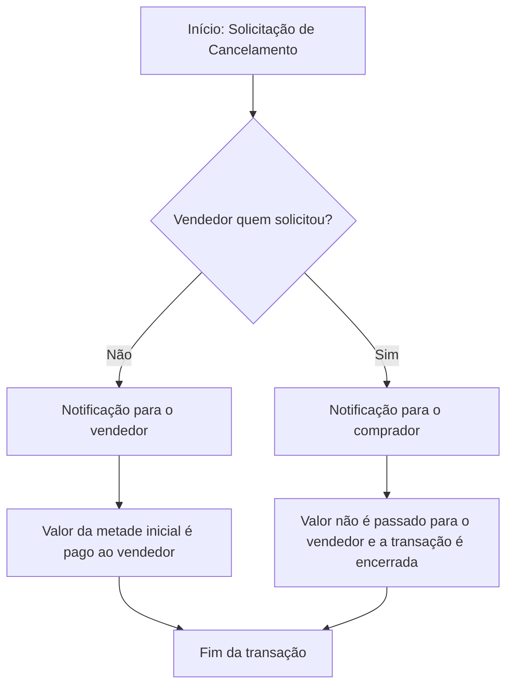

```mermaid
graph TD;

    A[Início: Solicitação de Cancelamento] --> B{Vendedor quem solicitou?}
    B --> |Sim| C[Notificação para o comprador]
    B --> |Não| D[Notificação para o vendedor]
    C --> E[Valor não é passado para o vendedor e a transação é encerrada]
    D --> F[Valor da metade inicial é pago ao vendedor]
    F --> Final[Fim da transação]
    E --> Final


```