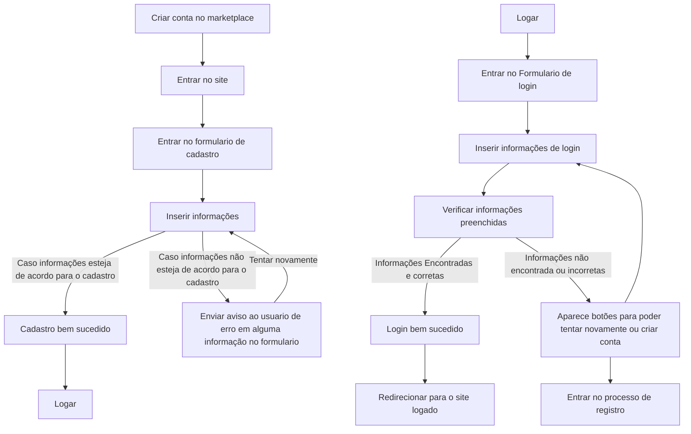
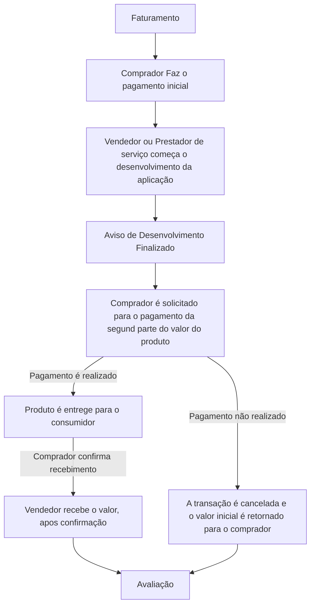
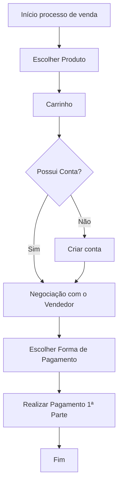

# O trabalho de engenharia de software é para criar uma empresa
Temos que fazer um projeto que tenha um criador de conteudo e usuario, ou um prestador de servico e um consumidor

# 4 Processos muito importantes

- Venda *A fazer*

- Cancelamento *A fazer*

- Faturamento *Feito* 

- NPS (Avaliação) *Dentro do Faturamento*

## A nossa empresa vai ter muito mais processos do que esses. Mas esses 4 são obrigatorios na avaliação!

# Nossa escolha atual

Uma plataforma de anuncio e vendas de produtos e serviçoes de tecnologia (marketplace), o anunciante pode escolher a porcentagem que vai nos dar do valor do produto para ser anunciado na nossa plataforma, para poder impulcionar o prduto de alguma forma, no caso vamos criar areas no nosso site para deixar com destaque esse produto

O anunciante pode anunciar varios produtos, com varias porcentagem de participação do lucro, ou seja, ele pode anunciar um produto que vale 100 reais e deixar 30 para nossa plataforma, isso vai nos dar um parametro de quanto ele pode ser bom para deixarmos ele em evidencia. 

Nosso site vai ter areas de cadastro, login, tela de configuração da conta, para mudar da conta comprador para conta de anunciante

Uma tela principal, onde vai ter os outdoors de anuncios dos produtos, essa tela tem que ter uma sazonalidade para ser sempre justo com os anunciantes

Tela de compra do produto

Tela de pesquisa, para encontrar produtos por categoria, depois de dar o enter no search que vai ter na tela principal

Tela de compras historicas

Tela de admin, para cadastros de categorias de produto

Tela de perfil, para mudar o tipo de conta

Se a conta for de vendedor uma tela para cadastro de produto

Tela de todos os produtos cadastrados do usuario vendedor

Tela de analise de vendas

Tela de analises comerciais do vendedor

Carrosel na tela inicial fixo (position absolute na direita) para os produtos que são confiaveis da nossa marca, uma media de venda boa e uma confiaça no produto (forma de recompensa para bons vendedores)

# Processo de cadastro

# Processo de Faturamento 

Comprador envia metado do valor do produto, vendedor começa a fazer o serviço, apos finalizado, o comprador é sinalizado para enviar a outra metade

comprador paga o restante, porem valor fica preso na plataforma, vendedor envia o produto, comprador confirma a entrega e o valor é entregue para o vendedor

# Processo de Venda 

