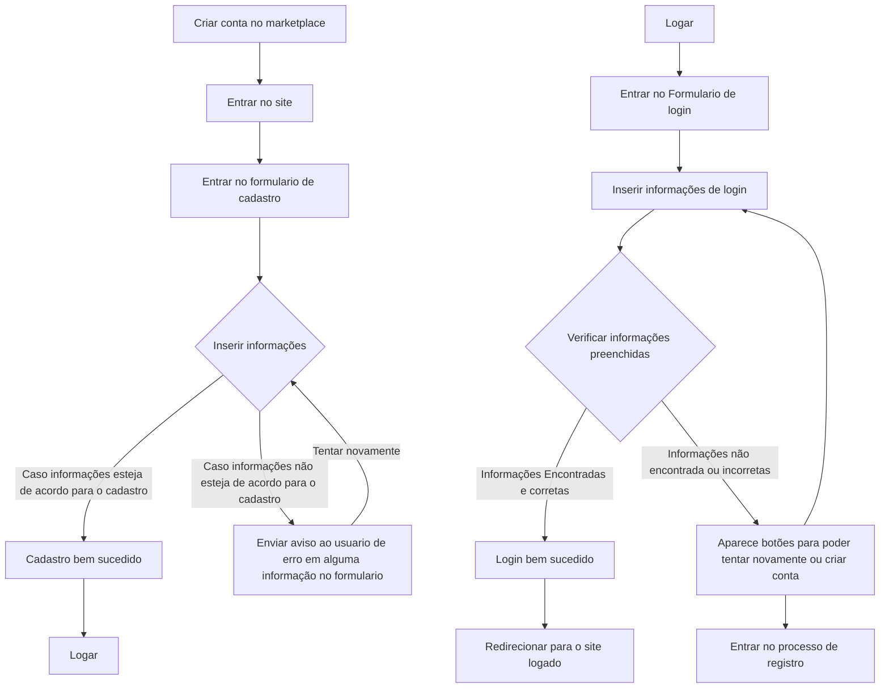
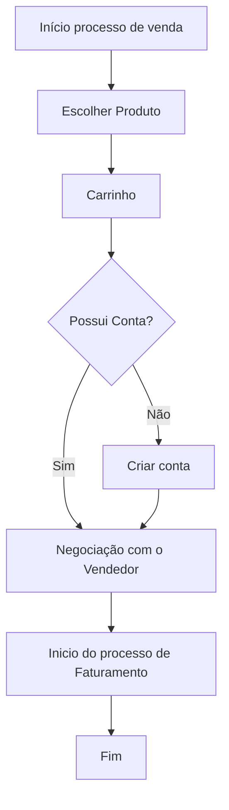
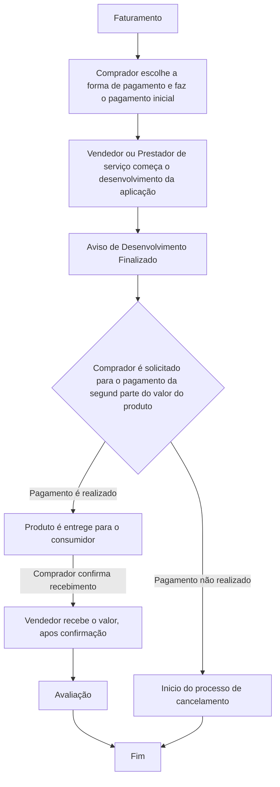
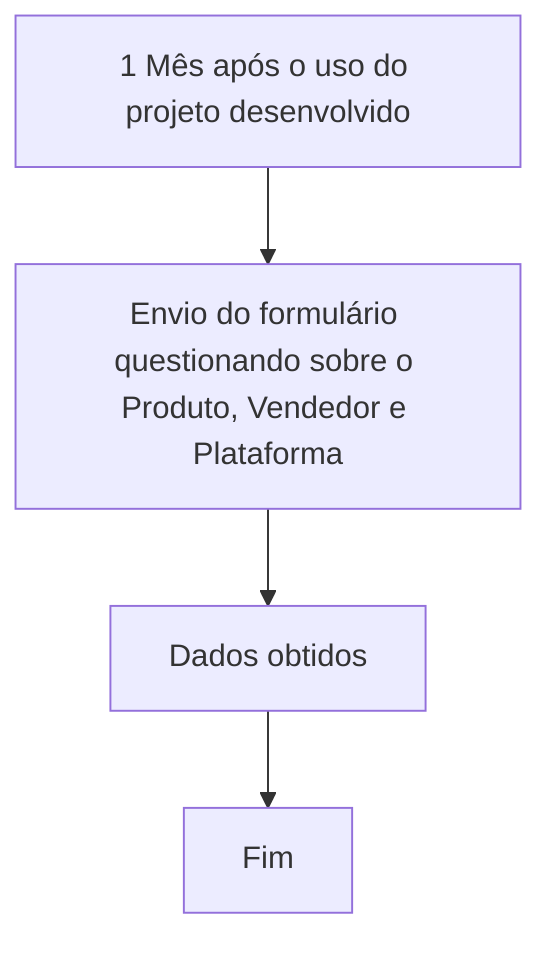
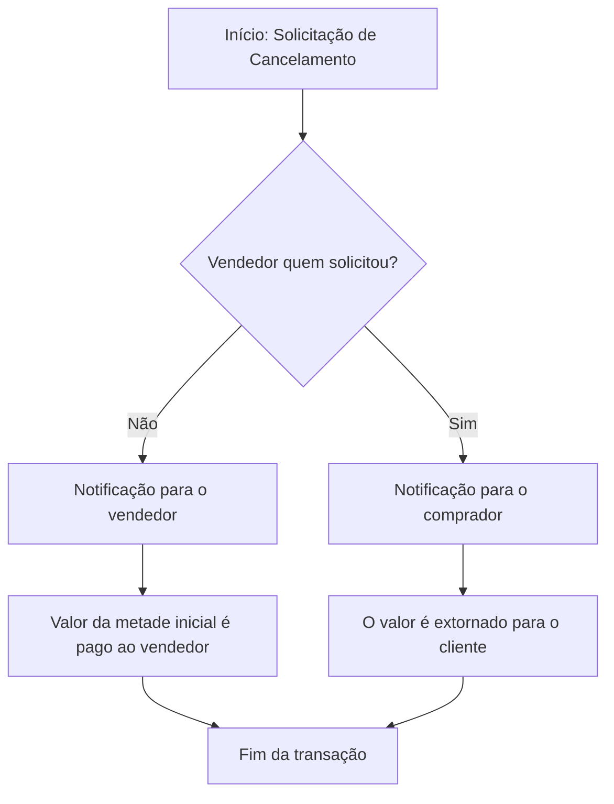
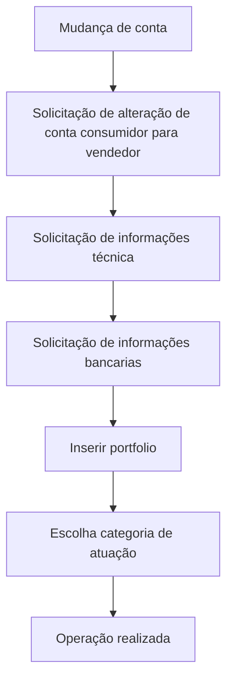

# O trabalho de engenharia de software é para criar uma empresa
Temos que fazer um projeto que tenha um criador de conteudo e usuario, ou um prestador de servico e um consumidor

# Processos
- Cadastro e Login
- Faturamento
- Venda
- Avaliação
- Cancelamento
- Mudança de Conta

# Nossa escolha atual

Uma plataforma de anuncio e vendas de produtos e serviçoes de tecnologia (marketplace), o anunciante pode escolher a porcentagem que vai nos dar do valor do produto para ser anunciado na nossa plataforma, para poder impulsionar o produto de alguma forma, no caso vamos criar areas no nosso site para deixar com destaque esse produto

O anunciante pode anunciar varios produtos, com varias porcentagem de participação do lucro, ou seja, ele pode anunciar um produto que vale 100 reais e deixar 30 para nossa plataforma, isso vai nos dar um parametro de quanto ele pode ser bom para deixarmos ele em evidencia. 

# Telas

Uma tela principal, onde vai ter os outdoors de anuncios dos produtos, essa tela tem que ter uma sazonalidade para ser sempre justo com os anunciantes

Tela de compra do produto

Tela de pesquisa, para encontrar produtos por categoria, depois de dar o enter no search que vai ter na tela principal

Tela de compras historicas

Tela de admin, para cadastros de categorias de produto

Tela de perfil, para mudar o tipo de conta

Se a conta for de vendedor uma tela para cadastro de produto

Tela de todos os produtos cadastrados do usuario vendedor

Tela de analise de vendas

Tela de analises comerciais do vendedor

Tela de mudança de conta

Carrosel na tela inicial fixo (position absolute na direita) para os produtos que são confiaveis da nossa marca, uma media de venda boa e uma confiaça no produto (forma de recompensa para bons vendedores)

# Processo de cadastro
O usuário deve informar os campos obrigatórios, como nome, CPF, e-mail e senha. 

O sistema valida o formato do e-mail, a autenticidade do documento e a segurança da senha. 

Após a validação, um e-mail de confirmação é enviado para ativação da conta. Em caso de problemas, o suporte deve ser contatado.

## Atividades de Cadastro
1. Usuario entra na tela de cadstro
2. Preenche os campos obrigatorio (CPF,e-mail,nome,data de nascimento,telefone,endereço)
3. Processo valida as informações
4. Cadastro efetuado

## Atividades de Login
1. Usuario entra na tela de login
2. Usuario preenche o formulario de login
3. As informações são validadas em nosso banco
4. Usuario é logado e pode criar seu carrinho

## Diagrama

# Processo de Venda 

O processo de venda se inicia quando o comprador escolhe um produto/serviço e o adiciona no carrinho de compras, após isso fazemos a verificação de conta onde pode ser necessário ou não direcionar o cliente para o processod de cadastro.

Após isso um chat com o vendedor é aberto onde pode ocorrer negecociações ou esclarecimento de dúvidas.
Com todos os pontos em ordem iniciamos o processo de faturamento
## Atividades
1. O usuario entra no catalogo 
2. Seleciona o produto
3. Na tela do produto ele pode adicionar no carrinho 
4. Entra na tela de pagamento do carrinhho
5. Inicia o processo de faturamento

## Diagrama

# Processo de Faturamento 

O comprador deve enviar metade do valor do produto, que fica retido dentro da plataforma, após isso o vendedor começa o desenvolvimento, quando o produto está finalizado o consumidor é notificado e deve pagar a segunda parte do valor.

Quando a segunda parte do valor é paga o vendedor envia o produto, após a confirmação da entrega do produto por parte do consumidor o valor retido na plataforma é enviado para o vendedor com o desconto da plataforma

## Atividades
1. Comprador escolhe a forma de pagamento
2. Comprador faz o pagamento da primeira parcela
3. Vendedor inica o desenvolvimento
4. Comprador recebe a solicitação de pagamento da segunda parte
5. Caso o comprador pague a segunda parte o produto é entregue ao comprador
6. Caso contrário o processo de cancelamento se inicia
7. Inicio do processo de avaliação

## Diagrama

# Processo de Avaliação
No processo de avaliação nós enviamos um formulário para o comprador, após um mês com produto/serviço em mãos, para registrar informações sobre a avaliação do produto e comentários que o comprador achar relevenate registrar

## Atividades
1. Um formulário é enviado ao comprador após 1 mês da compra produto
2. Comprador preenche o formulário com a avaliação do Produto, Vendedor e Plataforma
3. Registramos os dados

## Diagrama

# Processo de Cancelamento
Nesse processo nós recebemos a solicitação do cancelamento por alguma das partes envolvidas na compra, caso o vendedor seja o solicitante então a primeira parcela paga pelo comprador é devolvida para o comprador.

Caso o solicitante seja o próprio comprador então o valor pago da primeira parcela será direcionado ao o vendedor para compensar pelo período que ele passou desenvolvendo.

## Atividades
1. Solicitação de cancelamento.
2. Caso o vendedor tenha solicitado, o valor será extornado ao cliente.
3. Caso o cliente tenha solicitado, o valor pago anteriormente irá para o vendedor.
   

# Processo de Mudança de Tipo de Conta
Quando o recebemos a solicitação de alteração de conta de consumidor para vendedor, nós enviamos um formulário para cadastrar as informações técnicas do vendedor
Solicitamos também as informações bancárias do vendedor para os pagamentos e a opção do vendedor inserir portifólios, caso tenha, para os compradores poderem consultar antes de fazer a compra
E por fim o vendedor deve escolher pelo menos uma área de atuação.

## Atividades
1. Solicitação de mudança de conta
2. Preenchimento de informações pessoais
3. Preenchimento de informações técnicas
4. Solicitacão do Portólio de projetos
5. Validação das informações do usuário
6. Mudança de conta 
   

