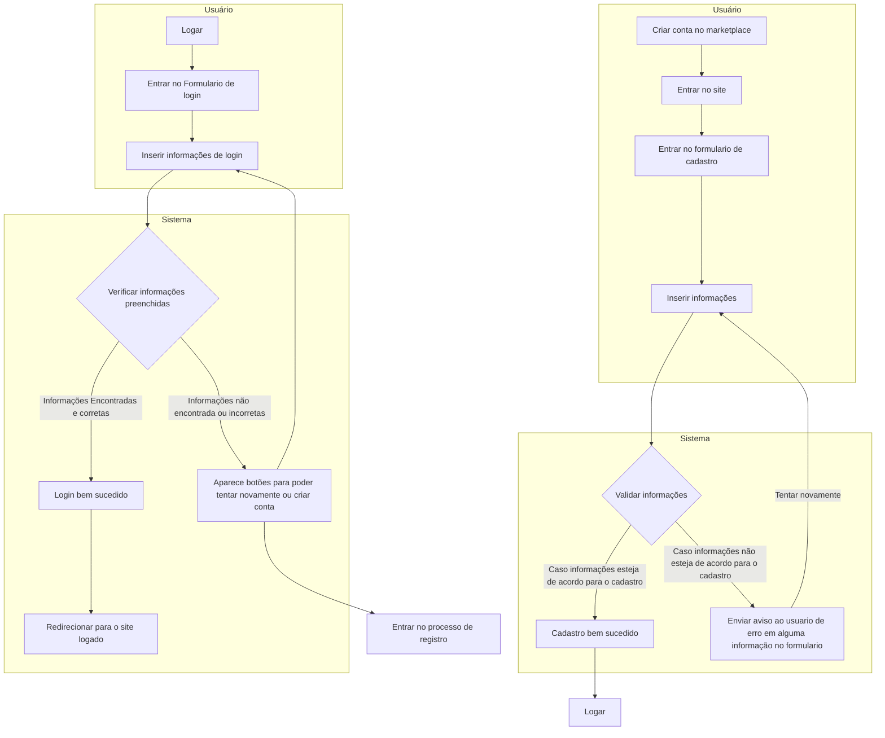
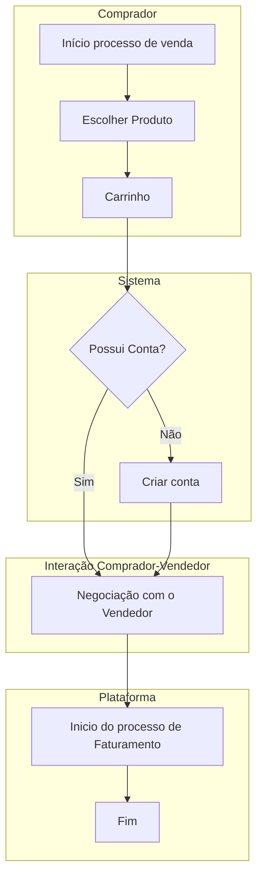
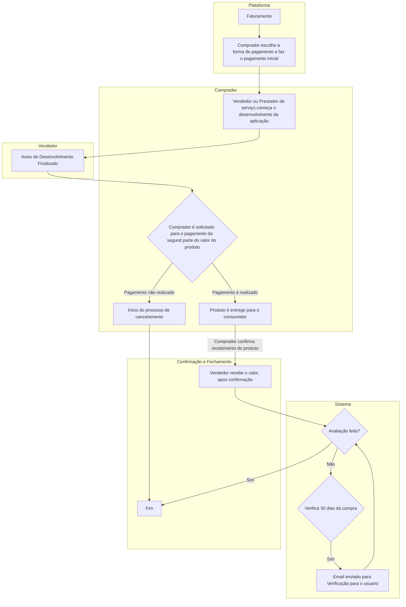
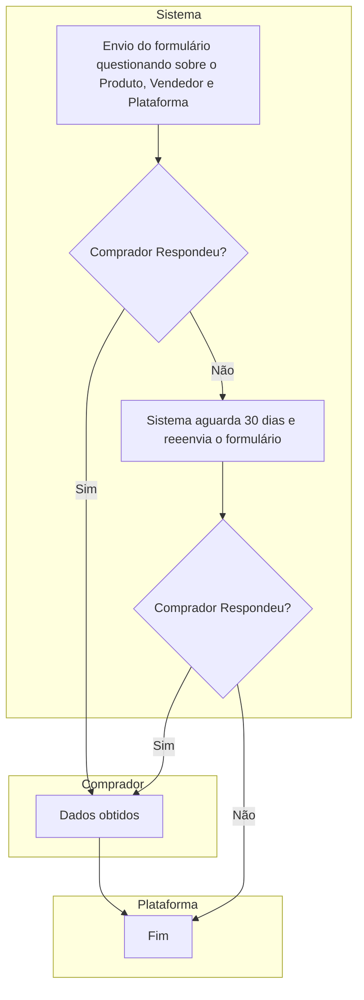
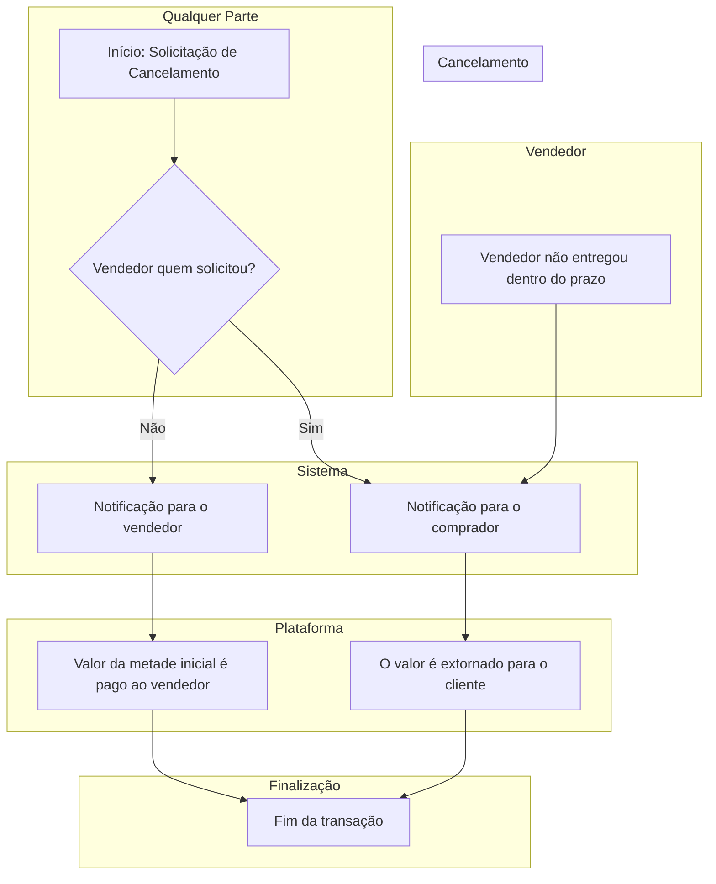
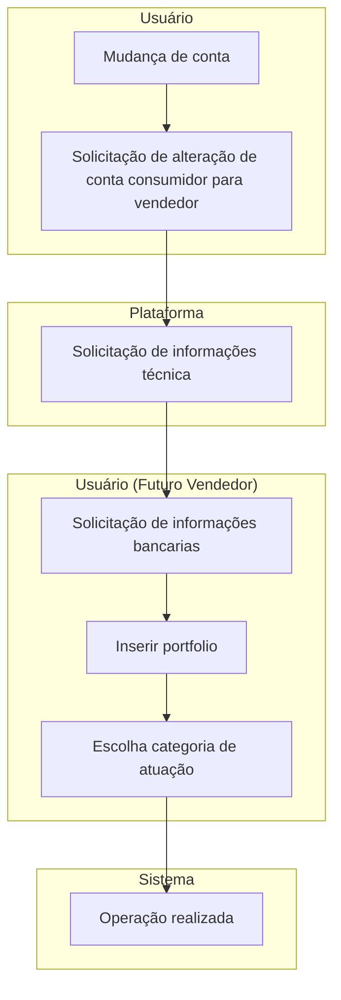
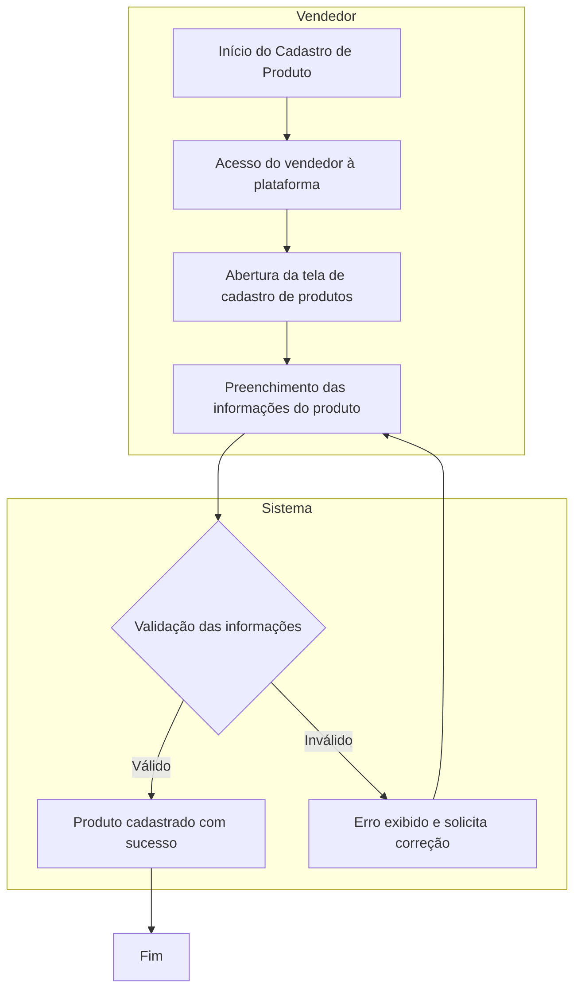

# TechSales

Uma plataforma de anuncio e vendas de produtos e serviçoes de tecnologia (marketplace)

O anunciante pode escolher a porcentagem que vai nos dar do valor do produto para ser anunciado na nossa plataforma, para poder impulsionar o produto de alguma forma, no caso vamos criar areas no nosso site para deixar com destaque esse produto

O anunciante pode anunciar varios produtos, com varias porcentagem de participação do lucro, ou seja, ele pode anunciar um produto que vale 100 reais e deixar 30 para nossa plataforma, isso vai nos dar um parametro de quanto ele pode ser bom para deixarmos ele em evidencia. 

# Processos
- Cadastro e Login
- Faturamento
- Venda
- Avaliação
- Cancelamento
- Mudança de Conta
- Cadastro de Produto

# Telas
[Link para o Figma](https://www.figma.com/proto/GuRgTCdNa190YvrwySZECE/TechSalePrototype?node-id=1-206&t=JLEv2V37cKdZ74rR-1)

# Processo de cadastro
O usuário deve informar os campos obrigatórios, como nome, CPF, e-mail e senha. 

O sistema valida o formato do e-mail, a autenticidade do documento e a segurança da senha. 

Após a validação, um e-mail de confirmação é enviado para ativação da conta. Em caso de problemas, o suporte deve ser contatado.

## Atividades de Cadastro
1. Usuario entra na tela de cadstro
2. Preenche os campos obrigatorio (CPF,e-mail,nome,data de nascimento,telefone,endereço)
3. Processo valida as informações
4. Cadastro efetuado

## Atividades de Login
1. Usuario entra na tela de login
2. Usuario preenche o formulario de login
3. As informações são validadas em nosso banco
4. Usuario é logado e pode criar seu carrinho

## Diagrama

# Processo de Venda 

O processo de venda se inicia quando o comprador escolhe um produto/serviço e o adiciona no carrinho de compras, após isso fazemos a verificação de conta onde pode ser necessário ou não direcionar o cliente para o processod de cadastro.

Após isso um chat com o vendedor é aberto onde pode ocorrer negecociações ou esclarecimento de dúvidas.
Com todos os pontos em ordem iniciamos o processo de faturamento
## Atividades
1. O usuario entra no catalogo 
2. Seleciona o produto
3. Na tela do produto ele pode adicionar no carrinho 
4. Entra na tela de pagamento do carrinhho
5. Inicia o processo de faturamento

## Diagrama

# Processo de Faturamento 

O comprador deve enviar metade do valor do produto, que fica retido dentro da plataforma, após isso o vendedor começa o desenvolvimento, quando o produto está finalizado o consumidor é notificado e deve pagar a segunda parte do valor.

Quando a segunda parte do valor é paga o vendedor envia o produto, após a confirmação da entrega do produto por parte do consumidor o valor retido na plataforma é enviado para o vendedor com o desconto da plataforma

## Atividades
1. Comprador escolhe a forma de pagamento
2. Comprador faz o pagamento da primeira parcela
3. Vendedor inica o desenvolvimento
4. Comprador recebe a solicitação de pagamento da segunda parte
5. Caso o comprador pague a segunda parte o produto é entregue ao comprador
6. Caso contrário o processo de cancelamento se inicia
7. Inicio do processo de avaliação

## Diagrama

# Processo de Avaliação
No processo de avaliação nós enviamos um formulário para o comprador, após um mês com produto/serviço em mãos, para registrar informações sobre a avaliação do produto e comentários que o comprador achar relevenate registrar

## Atividades
1. Um formulário é enviado ao comprador após 1 mês da compra produto
2. Comprador preenche o formulário com a avaliação do Produto, Vendedor e Plataforma
3. Registramos os dados

## Diagrama

# Processo de Cancelamento
Nesse processo nós recebemos a solicitação do cancelamento por alguma das partes envolvidas na compra, caso o vendedor seja o solicitante então a primeira parcela paga pelo comprador é devolvida para o comprador.

Caso o solicitante seja o próprio comprador então o valor pago da primeira parcela será direcionado ao o vendedor para compensar pelo período que ele passou desenvolvendo.

## Atividades
1. Solicitação de cancelamento
2. Caso o vendedor tenha solicitado, o valor será extornado ao cliente
3. Caso o cliente tenha solicitado, o valor pago anteriormente irá para o vendedor
   

# Processo de Mudança de Tipo de Conta
Quando o recebemos a solicitação de alteração de conta de consumidor para vendedor, nós enviamos um formulário para cadastrar as informações técnicas do vendedor
Solicitamos também as informações bancárias do vendedor para os pagamentos e a opção do vendedor inserir portifólios, caso tenha, para os compradores poderem consultar antes de fazer a compra
E por fim o vendedor deve escolher pelo menos uma área de atuação.

## Atividades
1. Solicitação de mudança de conta
2. Preenchimento de informações técnicas
3. Preenchimento de informações bancárias
4. Solicitacão do Portólio de projetos
5. Validação das informações do usuário
6. Mudança de conta 
   

# Processo de Cadastro de Produto

O processo de cadastro de produto permite que o vendedor registre novos produtos ou serviços na plataforma, especificando detalhes como nome, descrição, preço, imagens e porcentagem de comissão destinada à plataforma. Esse processo garante que os produtos fiquem disponíveis para compra pelos consumidores.

## Atividades
1. O vendedor acessa sua conta na plataforma.
2. O vendedor entra na tela de cadastro de produtos.
3. O vendedor preenche as informações necessárias, incluindo:
   - Nome do produto/serviço
   - Descrição detalhada
   - Categoria
   - Preço
   - Porcentagem de comissão para a plataforma
   - Imagens do produto
   - Opções de estoque (caso aplicável)
4. O sistema valida os dados inseridos.
5. Caso os dados sejam válidos, o produto é cadastrado com sucesso e passa a ficar disponível na plataforma.
6. Caso haja alguma inconsistência, o sistema exibe uma mensagem de erro e solicita a correção das informações.

## Diagrama

# Metodologia Ágil: 

A metodologia ágil escolhida foi uma combinação do Scrum e Kanban.
Escolhemos essas metodologias por que com o trabalho dividido em sprints e histórias de usuário e recebendo feedbacks constantes do cliente sobre o nosso projeto, com o apoio de protótipos, nós podemos ter uma evolução constante e incremental, evitando retrabalho e documentando nosso progresso para que possamos reaproveitar em momentos futuros, garantindo que o resultado final atenda as todas necessidades e expectativas.
Somando isso com o quadro Kanban podemos facilitar o monitoramento dos avanços da equipe e controle do fluxo de trabalho. Assim nossa evolução, além de mais efetiva, será também mais organizada.

# Stakeholders do Sistema

## 1. Compradores
- **Impacto:** Nossa plataforma irá oferecer aos compradores uma grande variedade de produtos/serviços de tecnologia com segurança, interface intuitiva e avaliações confiáveis.

## 2. Vendedores
- **Impacto:** A plataforma proporcionará visibilidade e segurança para profissionais que oferecem produtos ou serviços tecnológicos, permitindo ampliar sua base de clientes e fortalecer sua presença digital.

## 3. Pagamento

- **Impacto** A presença de um stakeholder de pagamento impacta diretamente a segurança, usabilidade e viabilidade financeira do sistema, garantindo transações confiáveis e conformidade com normas. Sem ele, o risco de falhas operacionais e legais aumenta significativamente.

# Técnica de Coleta de Requisitos

Para o TechSales, a técnica mais adequada para coleta de requisitos seria a combinação de Prototipação, questionário e Brainstorming.

## Justificativa:

1. **Prototipação:**
   - Será útil para desenvolver protótipos visuais, facilitando a validação de ideias com os futuros usuários e obter feedback rápido de stakeholders. Além de ajudar a identificar ajustes de usabilidade. 

2. **Questionários:**
   - Os questionários serão divulgados em comunidades abertas de tecnologia, e usados para coletar feedbacks rápidos e em larga escala sobre as necessidades e desejos que usuários de outras plataformas possuem.

3. **Brainstorming:**
   - Reuniões com a equipe para organizar e propor ideias e soluções da plataforma.

# Requisitos Funcionais

- **RF01:** O sistema deve permitir o cadastro de novos usuários.
- **RF02:** O sistema deve permitir login de usuários cadastrados.
- **RF03:** O sistema deve permitir a alteração de conta de comprador para vendedor.
- **RF04:** O sistema deve oferecer suporte para recuperação de senha em caso de esquecimento.
- **RF05:** O sistema deve permitir que o usuário atualize suas informações pessoais.
- **RF06:** O sistema deve permitir que o usuário personalize as configurações de notificações.
- **RF07:** O sistema deve permitir que o usuário navegue entre as páginas.
- **RF08:** O sistema deve permitir que o vendedor adicione informações como portifólio, redes sociais, diplomas e conta bancária.
- **RF09:** O sistema deve permitir que o comprador e o vendedor troquem mensagens através de um chat.
- **RF10:** O sistema deve ser capaz de calcular a comissão por venda.
- **RF11:** O sistema deve gerar comprovantes de pagamento.
- **RF12:** O sistema deve permitir que o usuário cadastre as informações do cartão.
- **RF13:** O sistema deve permitir que o usuário escolha diferentes formas de pagamento, exemplo: cartão de crédito, transferência bancária e PIX.
- **RF14:** O sistema deve exibir os produtos cadastrados pelos vendedores.
- **RF15:** O sistema deve permitir que o usuário pesquise produtos específicos.
- **RF16:** O sistema deve permitir adicionar produtos ao carrinho de compras.
- **RF17:** O sistema deve permitir que compradores visualizem detalhes dos produtos.
- **RF18:** O sistema deve exibir os produtos em destaque.
- **RF19:** O sistema deve permitir que o usuário filtre os produtos por categoria e avaliação.
- **RF20:** O sistema deve exibir as avaliações.
- **RF21:** O sistema deve exibir as compras realizadas pelo usuário.
- **RF22:** O sistema deve permitir que o usuário filtre o produto do histórico de compras.
- **RF23:** O sistema deve notificar as novidades do site, caso o cliente cadastre seu email no newsletter.
- **RF24:** O sistema deve permitir que vendedores cadastrem produtos ex: nome, descrição, imagem, preço, categoria, detalhes adicionais e comissão da plataforma.
- **RF25:** O sistema deve permitir o upload de imagens para os produtos.
- **RF26:** O sistema deve permitir a edição e remoção de produtos cadastrados.
- **RF27:** O sistema deve permitir avaliação do produto, vendedor e plataforma.
- **RF28:** O sistema deve permitir solicitações de cancelamento por compradores ou vendedores.
- **RF29:** O sistema deve notificar as partes envolvidas sobre o cancelamento.
- **RF30:** O sistema deve disparar e-mails automaticamente alertando os usuários sobre comunicados importantes.

# Requisitos Não Funcionais

- **RNF01:** O sistema estará disponível 24 x 7, com disponibilidade de 99,98%.
- **RNF02:** O sistema será desenvolvido com a linguagem de programação Python.
- **RNF03:** Os dados serão armazenados em um banco de dados relacional SQL Server.
- **RNF04:** O sistema deverá atender às normas da LGPD.
- **RNF05:** O sistema deve realizar backup diariamente dos dados.
- **RNF06:** O sistema deve ser implantado em um ambiente de computação em Nuvem.
- **RNF07:** As informações serão criptografadas.
- **RNF08:** O sistema deve utilizar a ferramenta Docker.
- **RNF09:** O sistema deve ter interface intuitiva, com fácil acesso às funções principais do sistema e com campos descritivos.
- **RNF10:** O sistema deve voltar ao ar em caso de falha em até 30 minutos.
- **RNF11:** O sistema deve suportar até 100.000 usuários simultâneos.
- **RNF12:** O sistema deve ser compatível com os principais navegadores (Chrome, Firefox, Safari, Edge).
- **RNF13:** A interface deve ser responsiva e funcionar em dispositivos móveis e desktop. 
- **RNF14:** Os usuários serão identificados com email e senha. 
- **RNF15:** O tempo de resposta para o cadastro de um usuário será de até 3 segundos. 
- **RNF16:** O sistema deve fornecer retornos de ação para o usuário em casos:
    - Compra
    - Venda
    - Produto adicionado ou removido no carrinho
    - Produto anunciado
    - Produto entregue
    - Atualização de informações
    - Avaliação
    - Cancelamento
    - Pagamento
    - Cadastro, Login ou Logout realizado
- **RNF17:** O sistema deve notificar o comprador sobre uma venda em até 5 segundos após a confirmação da compra.
- **RNF18:** O sistema deve possuir o calculo para a validação do CPF fornecido pelo usuário é válido.
- **RNF19:** O sistema deve validar a existencia da conta bancaria do usuario vendedor.
- **RNF20:** O sistema deve validar as informações do cartão de credito do comprador.
- **RNF21:** O sistema deve verificar a nova senha com a anterior para realizar a troca de senha.
- **RNF22:** O sistema tem que conter sistema de aramazenamento de arquivos, para guardar os portifolios dos vendedores.
- **RNF23:** O sistema deve atualizar as informações diretamento no banco de dados em menos de 2 segundos.
- **RNF24:** O sistema deve verificar a data das entregas todos os dias para o envio dos formularios de avaliação.
- **RNF25:** O sistema deve armazenar as avaliações e utilizar para algoritmos de recomendação.
- **RNF26:** O sistema deve retornar uma pesquisa feita pelo usuário em 2 segundos.
- **RNF27:** O sistema deve carregar a página do site em menos de 3 segundos.
- **RNF28:** O sistema deve processar pagamentos em menos de 10 segundos.
- **RNF29:** O sistema deve validar o formato do e-mail, autenticidade do documento e segurança da senha.

# Regras de Negócio

- **RN01** : Todo usuário inicialmente é registrado como comprador.
- **RN02** : Todo usuario tem que se registrar com as seguintes informações:
    - Nome Completo
    - CPF
    - Data de Nascimento
    - Telefone
    - E-mail
    - Senha
    - CEP
    - Estado
    - Cidade
    - Rua
    - Número
    - Complemento (opcional)
    - Bairro

- **RN03** : Para se tornar vendedor, o usuário deve fornecer informações técnicas, bancárias e portfólio.
- **RN04** : Um mesmo usuário não pode comprar e avaliar seus próprios produtos.
- **RN05** : O vendedor define a porcentagem de comissão para a plataforma valor minimo de 5%.
- **RN06** : Produtos com maior porcentagem de comissão recebem maior destaque na plataforma (produtos em destaque).
- **RN07** : Produtos com boa média de vendas e alta confiabilidade ganham espaço no painel de produtos confiaveis.
- **RN08** : Todo pagamento é dividido em duas etapas (metade inicial, metade final).
- **RN09** : O valor da primeira etapa será retida até a confirmação da segunda etapa.
- **RN10** : A segunda metade só é solicitada após o vendedor finalizar o desenvolvimento/preparação.
- **RN11** : O valor da comissão será descontada do valor final pago, após a confirmação da segunda etapa.
- **RN12** : O valor é liberado para o vendedor somente após confirmação de entrega pelo comprador.
- **RN13** : Se o vendedor solicitar cancelamento, o valor pago é estornado integralmente ao comprador.
- **RN14** : Se o comprador solicitar cancelamento, o valor da primeira parcela é destinado ao vendedor como compensação com a taxa do produto.
- **RN15** : Após a entrega do produto, não é possível realizar cancelamento.
- **RN16** : O formulário de avaliação é enviado ao comprador 30 dias após a entrega, caso o produto ainda não tenha sido avaliado.
- **RN17** : Apenas compradores que finalizaram a compra podem avaliar produtos e vendedores.
- **RN18** : Avaliações são consideradas no algoritmo de destaque de produtos e vendedores.
- **RN19** : Todos os produtos devem pertencer a pelo menos uma categoria.
- **RN20** : O cadastro de produto deve conter os seguintes campos:
    - Nome do Produto/Serviço
    - Categoria
    - Subcategoria
    - Descrição Curta
    - Descrição Detalhada
    - Tags
    - Imagem Principal
    - Preço
    - Comissão da Plataforma
    - Desconto
    - Preço Final
    - Prazo de Entrega (Valor)
    - Prazo de Entrega (Unidade)
    - O que está incluído
    - O que não está incluído
    - Requisitos para o Comprador
- **RN21** : Imagens de produtos devem seguir padrões definidos (dimensões, tamanho).
- **RN22** : Descrições de produtos devem ter um mínimo de caracteres para garantir informações adequadas.

# Histórias de Usuário

 - **HU01:** Como comprador quero poder me cadastrar na plataforma para fazer compras.
 - **HU02:** Como vendedor quero poder alterar meu tipo de conta para vender meus produtos.
 - **HU03:** Como usuário quero poder recuperar minha senha em caso de esquecimento.
 - **HU04:** Como usuário quero poder alterar minhas informações pessoais para deixa-las atualizadas.
 - **HU05:** Como usuário quero poder personalizar as configurações de notificação para deixa-las de minha preferência.
 - **HU06:** Como usuário quero receber notificações sobre novidades do site.
 - **HU07:** Como vendedor quero poder cadastrar meu portfólio, rede social e habilidades profissionais para atrair compradores.
 - **HU08:** Como vendedor quero poder cadastrar minhas informações bancárias para receber meu dinheiro.
 - **HU09:** Como comprador quero poder trocar mensagens com o vendedor para tirar dúvidas sobre o produto e negociar valores.
 - **HU10:** Como vendedor quero poder trocar mensagens com o comprador para tirar dúvidas sobre as regras de negócio do projeto.
 - **HU11:** Como vendedor quero receber meu dinheiro após a entrega do produto.
 - **HU12:** Como comprador quero receber um comprovante do meu pagamento para ter a garantia da minha transferência.
 - **HU13:** Como usuário quero cadastrar as minhas informações bancárias.
 - **HU14:** Como comprador quero poder escolher diferentes formas de pagamento.
 - **HU15:** Como vendedor quero que meus produtos cadastrados sejam exibidos pelo sistema.
 - **HU16:** Como usuário quero poder navegar entre as páginas para descobrir os produtos.
 - **HU17:** Como vendedor quero acessar minhas vendas para administração.
 - **HU18:** Como usuário quero poder pesquisar por produtos para facilitar minha busca.
 - **HU19:** Como usuário quero poder adicionar produtos ao carrinho de compras para comprar futuramente.
 - **HU20:** Como comprador quero visualizar meu histórico de compras.
 - **HU21:** Como comprador quero poder visualizar mais detalhes sobre o produto para entender mais sobre o produto.
 - **HU22:** Como usuário quero poder filtrar produtos por categoria para facilitar minha busca.
 - **HU23:** Como usuário quero poder ver as avaliações dos produtos para identificar produtos com melhores avaliações.
 - **HU24:** Como usuário quero poder filtrar produtos no meu histórico de compras.
 - **HU25:** Como vendedor quero poder cadastrar meus produtos com detalhes e imagens para realizar vendas.
 - **HU26:** Como vendedor quero poder editar as informações de um produto cadastrado para manter as informações atualizadas.
 - **HU27:** Como vendedor quero poder deletar um produto cadastrado para manter meu catálogo limpo e atualizado.
 - **HU28:** Como comprador quero poder avaliar produtos já comprado para ajudar outros usuário.
 - **HU29:** Como comprador quero poder cancelar compras não finalizadas que não desejo comprar mais.
 - **HU30:** Como vendedor quero poder cancelar produtos não finalizadas que não desejo desenvolver mais.
 - **HU31:** Como usuário quero receber notificações sobre cancelamentos.

